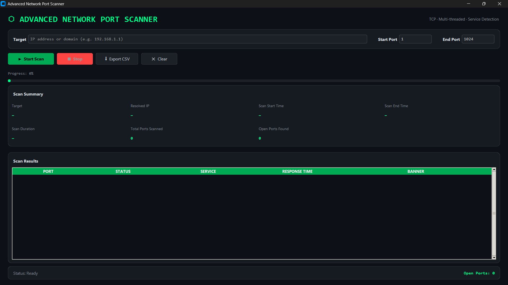

# 🚀 Advanced Network Port Scanner


A professional Python-based **Advanced Network Port Scanner** designed for fast TCP port scanning, service detection, banner grabbing, DNS resolution, and CSV export.

This project follows a modular architecture, making it easy to extend with additional networking features.

---

# ✨ Features

- ⚡ Fast Multi-Port TCP Scanning
- 🌐 DNS Resolution
- 🔍 Service Detection
- 📡 Banner Grabbing
- 🎨 Clean Terminal UI
- 📊 CSV Export
- ✅ Input Validation
- 📂 Modular Project Structure
- 📝 Logging Support
- 🧩 Easily Extendable

---

# 📂 Project Structure

```text
Advanced-Network-Port-Scanner/
│
├── portscanner/
│   ├── core/
│   ├── network/
│   ├── ui/
│   ├── config.py
│   ├── constants.py
│   ├── logging_config.py
│   ├── models.py
│   └── validation.py
│
├── assets/
├── exports/
├── logs/
│
├── main.py
├── scanner.py
├── banner.py
├── ui.py
├── requirements.txt
└── README.md
```

---

# 🏗 Architecture

```text
             User
               │
               ▼
        Terminal Interface
               │
               ▼
          Input Validation
               │
               ▼
          Core Scanner
        ┌──────────────┐
        │              │
        ▼              ▼
 Banner Grabber   DNS Resolver
        │              │
        └──────┬───────┘
               ▼
        Service Detection
               │
               ▼
          CSV Export
```

---

# ⚙ Installation

Clone the repository

```bash
git clone https://github.com/shadoww80/Advanced-network-port-scanner.git
```

Move into the project

```bash
cd Advanced-network-port-scanner
```

Install dependencies

```bash
pip install -r requirements.txt
```

---

# ▶ Usage

Run the scanner

```bash
python main.py
```

---

# 📸 Screenshots

## Application Home




# 💻 Example Output

```text
======================================
      ADVANCED NETWORK PORT SCANNER
======================================

Target :
scanme.nmap.org

Scanning...

PORT      STATUS      SERVICE
22        OPEN        SSH
80        OPEN        HTTP
443       OPEN        HTTPS

Banner:
Apache/2.4

Scan completed successfully.

Results exported to exports/results.csv
```

---

# 🛠 Technologies Used

- Python
- socket
- threading
- csv
- logging
- ipaddress
- rich (if enabled)

---

# 📊 Project Highlights

✔ Modular Design

✔ Clean Code

✔ Banner Grabbing

✔ DNS Resolution

✔ Service Detection

✔ CSV Export

✔ Easy to Extend

---

# 🚀 Future Improvements

- UDP Port Scanning
- SYN Scan
- OS Detection
- IPv6 Support
- JSON Export
- GUI Version
- Vulnerability Detection
- NSE Script Support
- Mass Scanning
- Network Discovery

---

# 🤝 Contributing

Contributions are welcome.

1. Fork the repository
2. Create a new branch
3. Commit your changes
4. Open a Pull Request

---

# 📜 License

This project is licensed under the MIT License.

---

# ⭐ Support

If you found this project useful,

⭐ Star the repository

🍴 Fork it

📢 Share it

---

Made with ❤️ by **ShadowW80**